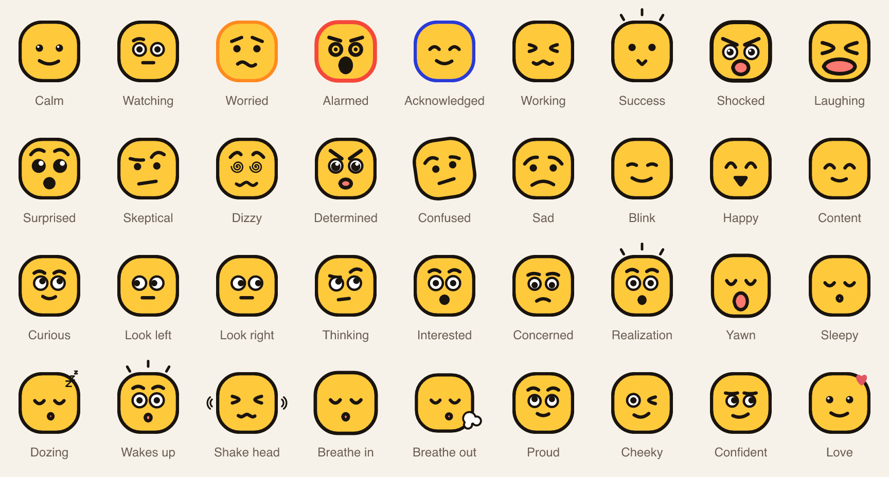

# critalarm-face

Crit is the mascot of [Crit Alarm](https://critalarm.app). This repo holds Crit's face as two
packages drawn from one spec:

- `dart/`: the Flutter package `critalarm_face`.
- `ts/`: the npm package `@anvilnine/critalarm-face`, for the web and Node.

Both give you 36 faces that blend into each other, an idle face that keeps itself busy, and 18
ringing animations. Both turn a face into the same list of draw ops, and the tests check that they
match.



## Install

### Flutter

The package is not on pub.dev yet. Add it as a git dependency, pinned to a tag:

```yaml
dependencies:
  critalarm_face:
    git:
      url: https://github.com/anvilnine/critalarm-face.git
      path: dart
      ref: v0.1.0
```

It needs Flutter 3.44 or later.

### npm

The package is not published to npm yet. Build it from this repo and install the tarball:

```sh
git clone https://github.com/anvilnine/critalarm-face.git
cd critalarm-face/ts
npm ci
npm run build
npm pack
# In your project:
npm install /path/to/critalarm-face/ts/anvilnine-critalarm-face-0.1.0.tgz
```

It is ESM only, needs Node 22 or later, and has no runtime dependencies.

## Quick start

### Flutter

```dart
import 'package:critalarm_face/critalarm_face.dart';

const FaceWidget(state: FaceState.calm, size: 120);
const IdleFace(size: 120);
const RingingFaceWidget(style: RingingStyle.classic, size: 160);

// Halfway between two faces.
FaceWidget(
  state: FaceState.calm,
  shape: FaceShape.lerp(faceFor(FaceState.calm), faceFor(FaceState.alarmed), 0.5),
);
```

### TypeScript

```ts
import { renderFaceSvg, blendFaces, mountFace } from "@anvilnine/critalarm-face";

const svg = renderFaceSvg("calm", { size: 128, palette: "dark" });
const halfway = renderFaceSvg(blendFaces("calm", "alarmed", 0.5), { size: 128 });

const face = mountFace(document.querySelector("#crit")!, { state: "calm", size: 160 });
face.setState("alarmed");
```

More in [`dart/README.md`](dart/README.md) and [`ts/README.md`](ts/README.md).

## Faces

The 36 face states, by the name both packages use:

`calm`, `watching`, `worried`, `alarmed`, `acked`, `working`, `success`, `shocked`, `laughing`,
`surprised`, `skeptical`, `dizzy`, `determined`, `confused`, `sad`, `blink`, `happy`, `content`,
`curious`, `lookLeft`, `lookRight`, `thinking`, `interested`, `concerned`, `realization`, `yawn`,
`sleepy`, `dozing`, `wakesUp`, `shakeHead`, `breatheIn`, `breatheOut`, `proud`, `cheeky`,
`confident`, `love`.

## Ringing styles

| Style | What it does |
|---|---|
| `classic` | Slammed brows, ringed eyes, a pulsing shout and sound waves. |
| `panic` | Pupils darting side to side, sweat flying, a wobbling scream. |
| `rage` | Flushing red, gritted teeth, steam jets and a throbbing vein. |
| `confused` | Head rocking under popping question marks, eyes out of step. |
| `dizzy` | Spinning swirl eyes, stars in orbit, head wobbling in circles. |
| `sobbing` | Wailing sobs that heave the head, tears arcing out both sides. |
| `scream` | Head stretched tall, pinprick pupils, a huge open scream. |
| `bellHead` | Two bells on its head and a striker, wincing at every clang. |
| `eyesPop` | Eyes boing out of the head, brows fly off, jaw drops. |
| `annoyed` | Heavy lids, a slow eye roll up and over, then a long sigh. |
| `startled` | Snoozing until the ring launches it into the air. |
| `hyperventilating` | Short fast breaths, cheeks puffing, sweat on the brow. |
| `zapped` | Flickering light and dark between bolts, then smoking. |
| `bouncing` | Bouncing off the floor, squashing flat on every landing. |
| `terrified` | Shrunk down, trembling, teeth chattering, eyes darting. |
| `siren` | A spinning siren on top, mouth going wee-oo, flushing red. |
| `meltdown` | Melting into drips under the heat, then snapping back. |
| `spinOut` | A full spin, then wobbling to a stop with swirling eyes. |

`ShufflingRingingFace` (Flutter) and `mountRingingFace(el, { style: "shuffle" })` (TypeScript)
move through the styles one after another.

## How the two packages stay the same

The Dart package is the reference. Every face, blend and ringing frame becomes a flat list of draw
ops: save, restore, translate, rotate, scale, clip, and draw an oval, rounded rect or path with a
fill or stroke. The Flutter painters replay those ops on a canvas.
The TypeScript package builds the same ops and replays them as SVG or on a 2D canvas.

- `dart/tool/export.dart` writes `spec/faces.json` (palettes, timings, every face) and
  `spec/fixtures/*.json` (the draw ops for every face in both palettes, blends between face pairs,
  ringing frames, and idle face runs).
- `dart/test/spec_up_to_date_test.dart` fails if the files in `spec/` are older than the Dart code.
- The TypeScript parity tests build the same cases and compare every number against the fixtures,
  within the tolerance set in [`spec/SPEC.md`](spec/SPEC.md).

`spec/SPEC.md` explains every field and op, so a port to another language can use the same
fixtures.

## Repo layout

| Path | What it holds |
|---|---|
| `dart/` | The Flutter package. `lib/` is the code, `test/` the tests, `tool/` the spec export. |
| `dart/example/` | A Flutter app with a gallery of every face, a blend playground, the idle face and every ringing style. |
| `ts/` | The TypeScript package. `src/` is the code, `test/` the parity and renderer tests. |
| `ts/examples/` | A browser page, an SVG and PNG exporter, and a video frame renderer. |
| `spec/` | `SPEC.md`, plus `faces.json` and `fixtures/`, generated from the Dart package. |
| `docs/images/` | The face gallery above, drawn by `ts/scripts/readme-image.mjs`. |

## Adding or changing a face

1. Change the Dart code in `dart/lib/`.
2. From `dart/`, run `fvm flutter test tool/export.dart` to rewrite `spec/`.
3. Port the change to `ts/src/`.
4. Run both test suites: `fvm flutter test` in `dart/`, and `npm test` in `ts/`.
5. Commit the code and the regenerated `spec/` files together.

Never edit the files in `spec/` by hand, apart from `SPEC.md`. [CONTRIBUTING.md](CONTRIBUTING.md)
has the full setup.

## Versions

Both packages share one version number and move together. A release is a git tag `vX.Y.Z` on this
repo. Changes are listed in [`dart/CHANGELOG.md`](dart/CHANGELOG.md) and
[`ts/CHANGELOG.md`](ts/CHANGELOG.md).

## About Crit

Crit is the Crit Alarm mascot. You are welcome to use this code in your own projects under the
license below. If you do, please don't present your project as the official Crit Alarm app or as
made by Anvil Nine.

## License

Apache-2.0. See [LICENSE](LICENSE) and [NOTICE](NOTICE).
