# Crit gallery

Generated by `ts/scripts/gallery.mjs`. Do not edit by hand: run `cd ts && npm run gallery`.
See [AGENTS.md](AGENTS.md) for when to run it.

Every face in both palettes as SVG and as a 512 px PNG with a transparent background, plus
animated WebP loops (256 px, 30 fps, transparent) of every face that moves, every ringing
style and the idle face. There are no GIFs: GIF has only on or off transparency, so the edges
look rough, and the files come out bigger.

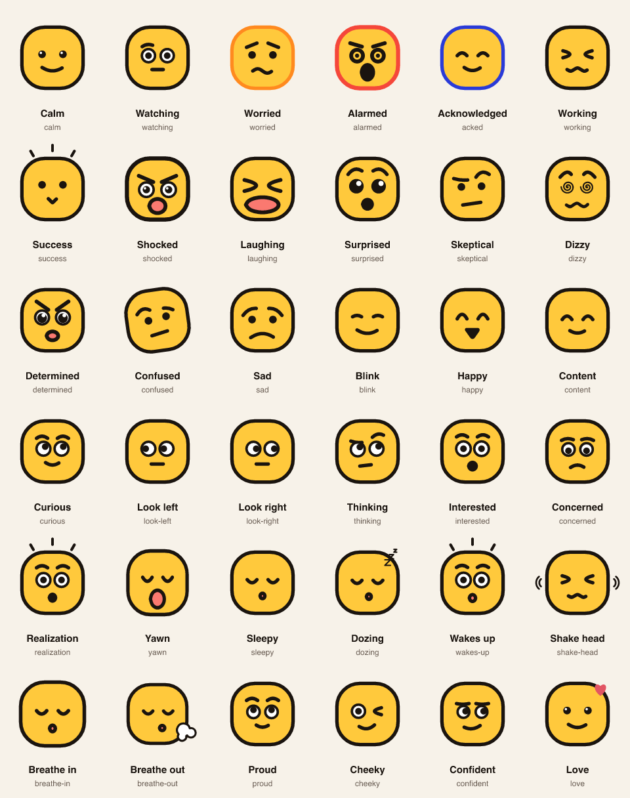

## Faces

| Face | Light | Dark | Moving |
|---|---|---|---|
| **Calm** `calm` |  [svg](faces/light/calm.svg) [png](faces/light/calm.png) |  [svg](faces/dark/calm.svg) [png](faces/dark/calm.png) |  |
| **Watching** `watching` |  [svg](faces/light/watching.svg) [png](faces/light/watching.png) | [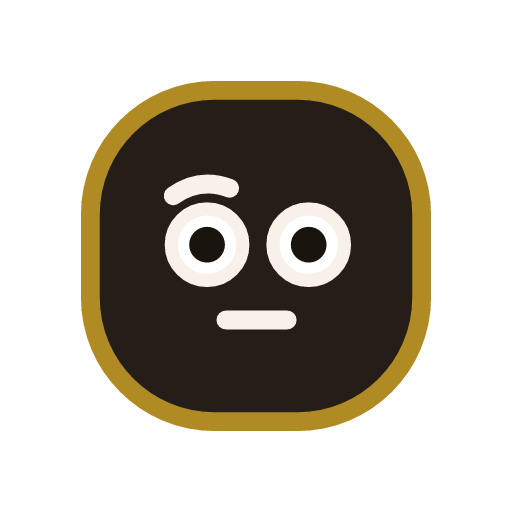](faces/dark/watching.png) [svg](faces/dark/watching.svg) [png](faces/dark/watching.png) |  |
| **Worried** `worried` |  [svg](faces/light/worried.svg) [png](faces/light/worried.png) | [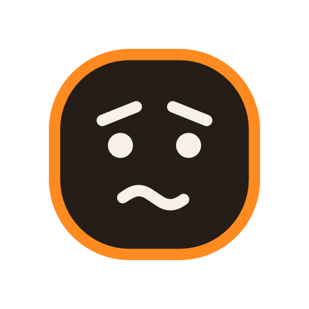](faces/dark/worried.png) [svg](faces/dark/worried.svg) [png](faces/dark/worried.png) |  |
| **Alarmed** `alarmed` |  [svg](faces/light/alarmed.svg) [png](faces/light/alarmed.png) |  [svg](faces/dark/alarmed.svg) [png](faces/dark/alarmed.png) |  |
| **Acknowledged** `acked` |  [svg](faces/light/acked.svg) [png](faces/light/acked.png) | [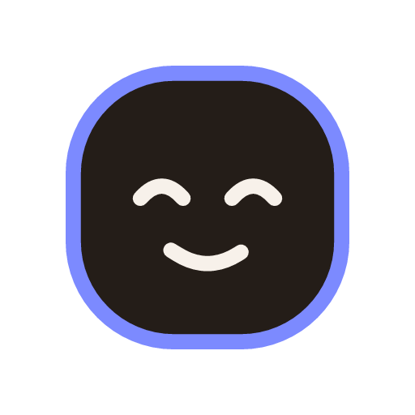](faces/dark/acked.png) [svg](faces/dark/acked.svg) [png](faces/dark/acked.png) |  |
| **Working** `working` |  [svg](faces/light/working.svg) [png](faces/light/working.png) |  [svg](faces/dark/working.svg) [png](faces/dark/working.png) |  |
| **Success** `success` |  [svg](faces/light/success.svg) [png](faces/light/success.png) | [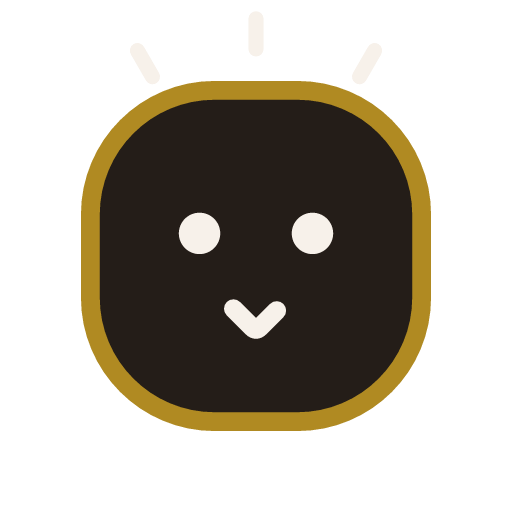](faces/dark/success.png) [svg](faces/dark/success.svg) [png](faces/dark/success.png) |  |
| **Shocked** `shocked` |  [svg](faces/light/shocked.svg) [png](faces/light/shocked.png) | [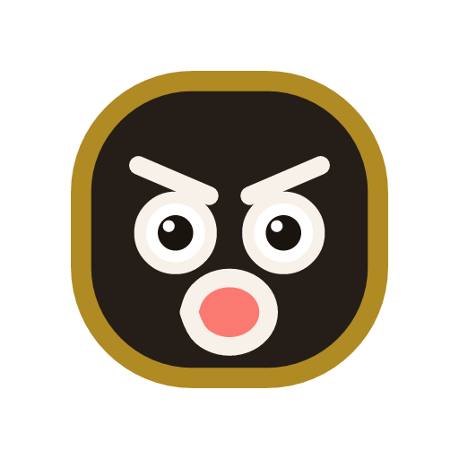](faces/dark/shocked.png) [svg](faces/dark/shocked.svg) [png](faces/dark/shocked.png) |  |
| **Laughing** `laughing` |  [svg](faces/light/laughing.svg) [png](faces/light/laughing.png) |  [svg](faces/dark/laughing.svg) [png](faces/dark/laughing.png) |  |
| **Surprised** `surprised` |  [svg](faces/light/surprised.svg) [png](faces/light/surprised.png) |  [svg](faces/dark/surprised.svg) [png](faces/dark/surprised.png) |  |
| **Skeptical** `skeptical` |  [svg](faces/light/skeptical.svg) [png](faces/light/skeptical.png) |  [svg](faces/dark/skeptical.svg) [png](faces/dark/skeptical.png) |  |
| **Dizzy** `dizzy` |  [svg](faces/light/dizzy.svg) [png](faces/light/dizzy.png) | [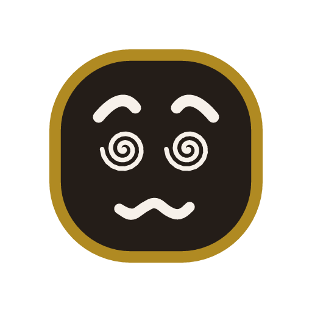](faces/dark/dizzy.png) [svg](faces/dark/dizzy.svg) [png](faces/dark/dizzy.png) |  |
| **Determined** `determined` | [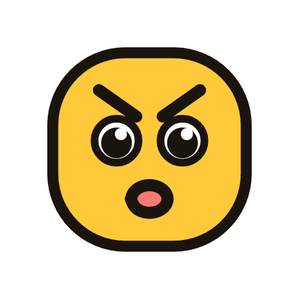](faces/light/determined.png) [svg](faces/light/determined.svg) [png](faces/light/determined.png) |  [svg](faces/dark/determined.svg) [png](faces/dark/determined.png) |  |
| **Confused** `confused` |  [svg](faces/light/confused.svg) [png](faces/light/confused.png) | [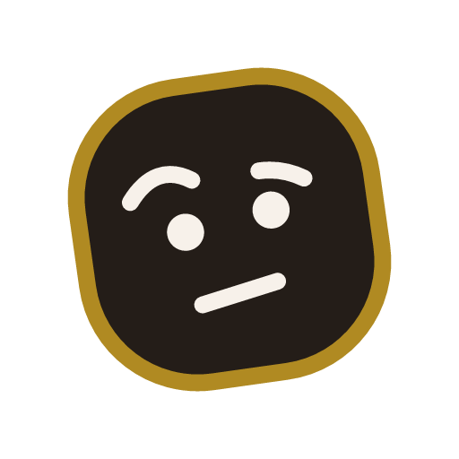](faces/dark/confused.png) [svg](faces/dark/confused.svg) [png](faces/dark/confused.png) |  |
| **Sad** `sad` |  [svg](faces/light/sad.svg) [png](faces/light/sad.png) |  [svg](faces/dark/sad.svg) [png](faces/dark/sad.png) |  |
| **Blink** `blink` |  [svg](faces/light/blink.svg) [png](faces/light/blink.png) |  [svg](faces/dark/blink.svg) [png](faces/dark/blink.png) |  |
| **Happy** `happy` |  [svg](faces/light/happy.svg) [png](faces/light/happy.png) |  [svg](faces/dark/happy.svg) [png](faces/dark/happy.png) |  |
| **Content** `content` |  [svg](faces/light/content.svg) [png](faces/light/content.png) |  [svg](faces/dark/content.svg) [png](faces/dark/content.png) |  |
| **Curious** `curious` |  [svg](faces/light/curious.svg) [png](faces/light/curious.png) |  [svg](faces/dark/curious.svg) [png](faces/dark/curious.png) |  |
| **Look left** `look-left` |  [svg](faces/light/look-left.svg) [png](faces/light/look-left.png) | [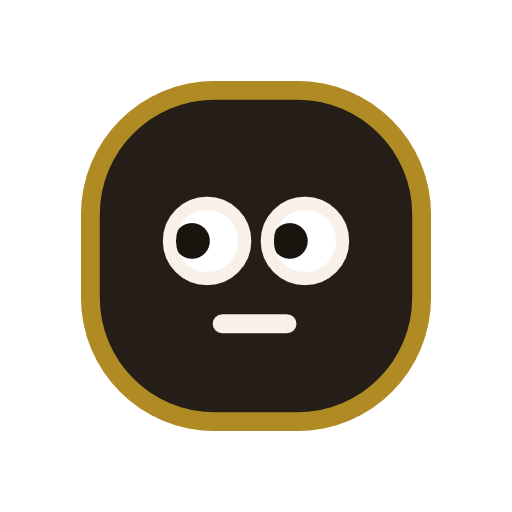](faces/dark/look-left.png) [svg](faces/dark/look-left.svg) [png](faces/dark/look-left.png) |  |
| **Look right** `look-right` |  [svg](faces/light/look-right.svg) [png](faces/light/look-right.png) | [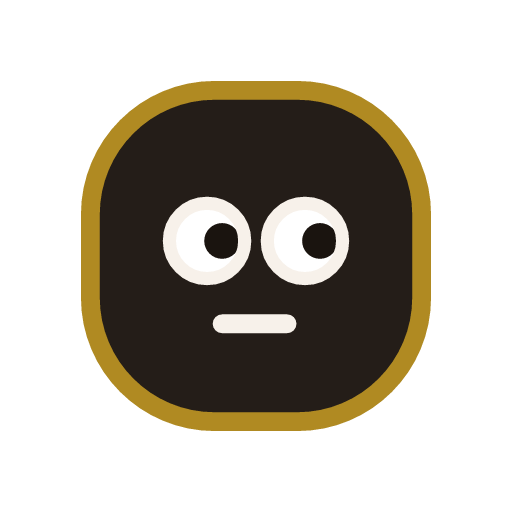](faces/dark/look-right.png) [svg](faces/dark/look-right.svg) [png](faces/dark/look-right.png) |  |
| **Thinking** `thinking` |  [svg](faces/light/thinking.svg) [png](faces/light/thinking.png) | [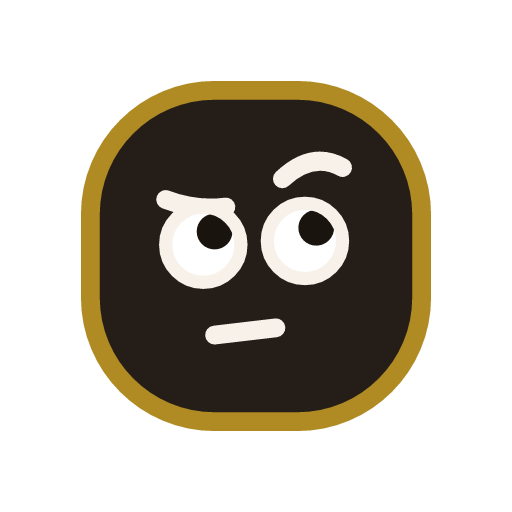](faces/dark/thinking.png) [svg](faces/dark/thinking.svg) [png](faces/dark/thinking.png) |  |
| **Interested** `interested` |  [svg](faces/light/interested.svg) [png](faces/light/interested.png) |  [svg](faces/dark/interested.svg) [png](faces/dark/interested.png) |  |
| **Concerned** `concerned` |  [svg](faces/light/concerned.svg) [png](faces/light/concerned.png) | [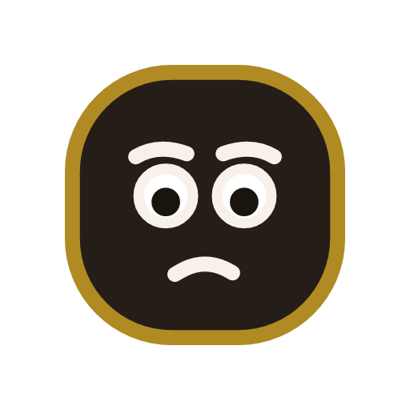](faces/dark/concerned.png) [svg](faces/dark/concerned.svg) [png](faces/dark/concerned.png) |  |
| **Realization** `realization` |  [svg](faces/light/realization.svg) [png](faces/light/realization.png) | [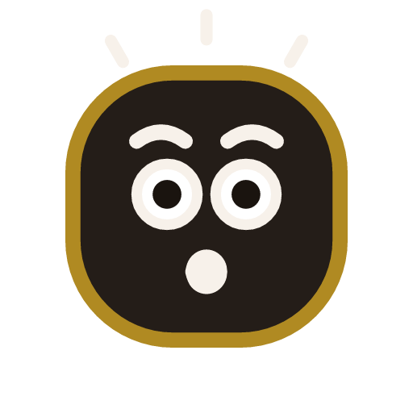](faces/dark/realization.png) [svg](faces/dark/realization.svg) [png](faces/dark/realization.png) |  |
| **Yawn** `yawn` |  [svg](faces/light/yawn.svg) [png](faces/light/yawn.png) | [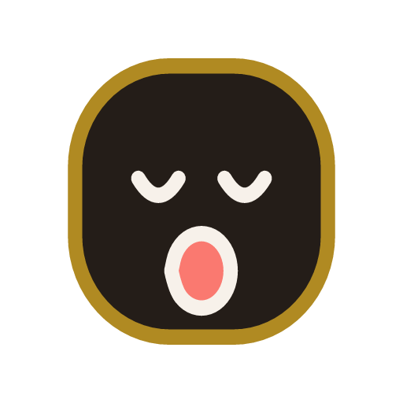](faces/dark/yawn.png) [svg](faces/dark/yawn.svg) [png](faces/dark/yawn.png) |  |
| **Sleepy** `sleepy` | [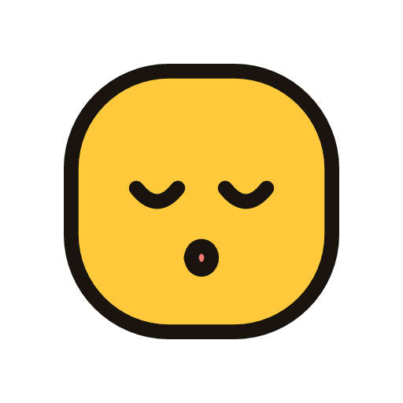](faces/light/sleepy.png) [svg](faces/light/sleepy.svg) [png](faces/light/sleepy.png) | [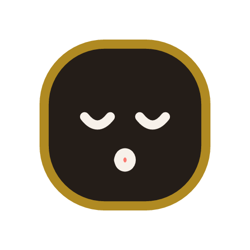](faces/dark/sleepy.png) [svg](faces/dark/sleepy.svg) [png](faces/dark/sleepy.png) |  |
| **Dozing** `dozing` |  [svg](faces/light/dozing.svg) [png](faces/light/dozing.png) | [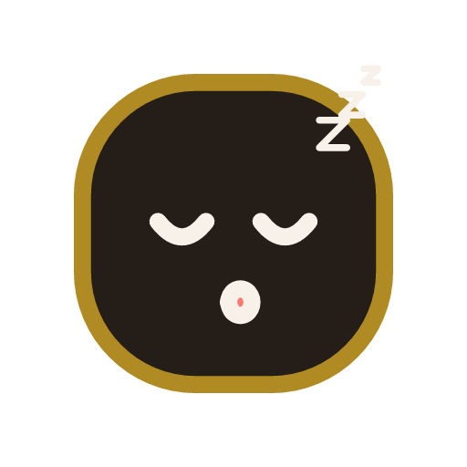](faces/dark/dozing.png) [svg](faces/dark/dozing.svg) [png](faces/dark/dozing.png) |  |
| **Wakes up** `wakes-up` |  [svg](faces/light/wakes-up.svg) [png](faces/light/wakes-up.png) | [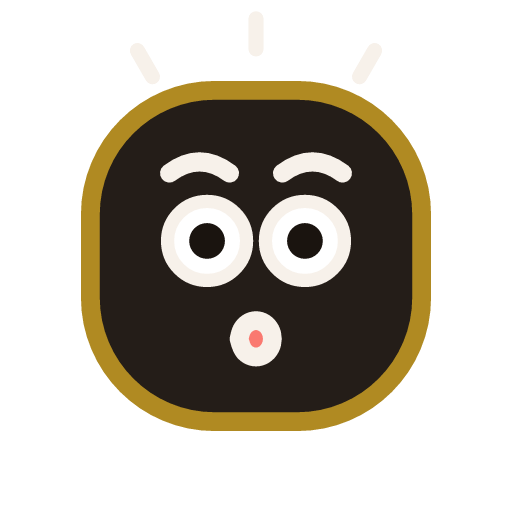](faces/dark/wakes-up.png) [svg](faces/dark/wakes-up.svg) [png](faces/dark/wakes-up.png) |  |
| **Shake head** `shake-head` |  [svg](faces/light/shake-head.svg) [png](faces/light/shake-head.png) | [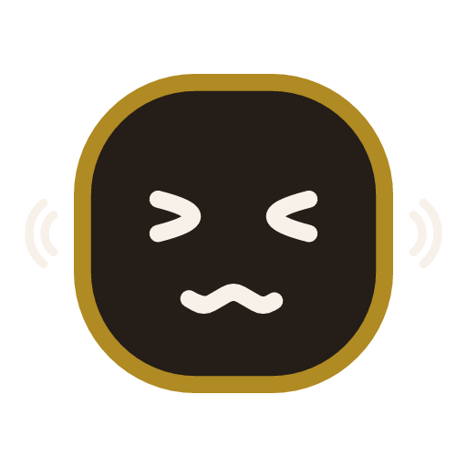](faces/dark/shake-head.png) [svg](faces/dark/shake-head.svg) [png](faces/dark/shake-head.png) |  |
| **Breathe in** `breathe-in` |  [svg](faces/light/breathe-in.svg) [png](faces/light/breathe-in.png) | [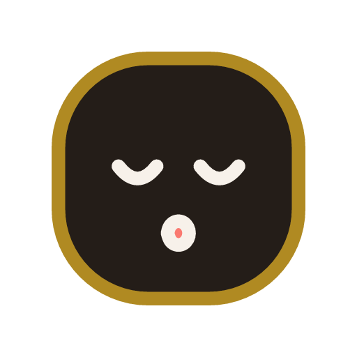](faces/dark/breathe-in.png) [svg](faces/dark/breathe-in.svg) [png](faces/dark/breathe-in.png) |  |
| **Breathe out** `breathe-out` |  [svg](faces/light/breathe-out.svg) [png](faces/light/breathe-out.png) | [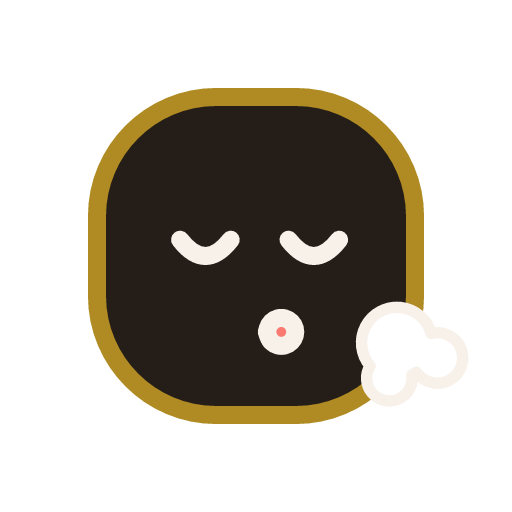](faces/dark/breathe-out.png) [svg](faces/dark/breathe-out.svg) [png](faces/dark/breathe-out.png) |  |
| **Proud** `proud` |  [svg](faces/light/proud.svg) [png](faces/light/proud.png) |  [svg](faces/dark/proud.svg) [png](faces/dark/proud.png) |  |
| **Cheeky** `cheeky` |  [svg](faces/light/cheeky.svg) [png](faces/light/cheeky.png) |  [svg](faces/dark/cheeky.svg) [png](faces/dark/cheeky.png) |  |
| **Confident** `confident` |  [svg](faces/light/confident.svg) [png](faces/light/confident.png) |  [svg](faces/dark/confident.svg) [png](faces/dark/confident.png) |  |
| **Love** `love` |  [svg](faces/light/love.svg) [png](faces/light/love.png) | [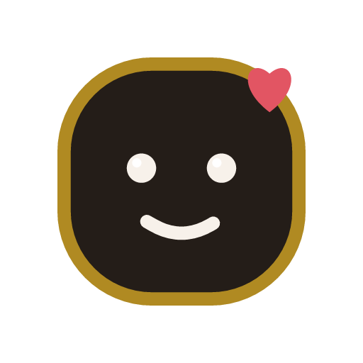](faces/dark/love.png) [svg](faces/dark/love.svg) [png](faces/dark/love.png) |  |

## Ringing

One full loop of each style.

| Style | Loop |
|---|---|
| **Classic ring** `classic` 1200 ms |  |
| **Panic** `panic` 1600 ms | [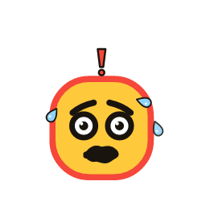](ringing/panic.webp) |
| **Rage** `rage` 1400 ms |  |
| **Confused** `confused` 2400 ms |  |
| **Dizzy** `dizzy` 2000 ms |  |
| **Sobbing** `sobbing` 1800 ms |  |
| **Scream** `scream` 1000 ms |  |
| **Alarm clock** `bell-head` 1200 ms |  |
| **Eyes pop** `eyes-pop` 1800 ms |  |
| **Annoyed** `annoyed` 2800 ms |  |
| **Startled awake** `startled` 2600 ms | [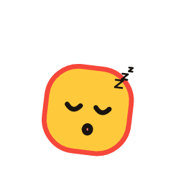](ringing/startled.webp) |
| **Hyperventilating** `hyperventilating` 900 ms |  |
| **Zapped** `zapped` 1600 ms |  |
| **Bouncing** `bouncing` 800 ms |  |
| **Terrified** `terrified` 1200 ms |  |
| **Siren** `siren` 1600 ms |  |
| **Meltdown** `meltdown` 3200 ms |  |
| **Spin out** `spin-out` 2000 ms |  |

## Idle

Ten seconds of the idle face, seed 5.

